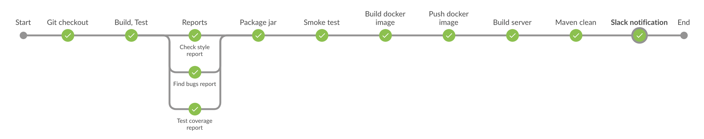

# DevOps exam  
`travis`  
[](https://travis-ci.com/NikitaZhevnitskiy/devops-exam)  
`jenkins`   
[](http://95.85.15.63:8080/job/master-Jenkinsfile/)

Original repository : https://github.com/NikitaZhevnitskiy/devops-exam   
Current repository contains app source code, Jenkinsfile, ansible scripts, kubernetes scripts, maven wrapper and process documentation.  
CD - Continuous delivery  
CI - Continuous integration
## 1 Application
Build server accessible on  [95.85.15.63:8082](http://95.85.15.63:8082/health-check)  
Calculator app is RESTful web-api with several endpoints. Client can make request to endpoints 
to get result of math operations. Application contains unit & controllers (RestAssured) tests.

`Numbers` json representation (example).
for request that requires body
```
 {
    "n1":4,
    "n2":3.2
 }
```  

`Endpoints`  
 
| Endpoint              | Result                |
| ----------------------|  :------------------: | 
| GET /health-check     | App name              | 
| POST /math/add        | result of +, requre body    | 
| POST /math/subtract   | result of -, requre body    | 
| POST /math/divide     | result of /, requre body, cant divide by zero    | 
| POST /math/multiply   | result of *, requre body    | 

App implemented using Spring framework, package in fat-jar.
No needs to deploy on server, jar file contains embedded tomcat server. 

I chose simple application, which allow me to focus on main part of exam. Automation processes for CI & CD. 
Also I integrated travis to run tests parallel.

## 2 Cloud 
I use Digital Ocean, because I had previous experience with it and account with 40$ there :)   
Machine stats:  
```
IP      : 95.85.15.63
OS      : Ubuntu 16.04.3 x64 
CORES   : 2
RAM     : 2GB
DISK    : 20GB
``` 
Access to machine via ssh or account on digital ocean. Access to account is 2-steps auth.  
Installations (I install it manually): 
* java
* jenkins
* kubectl
* minikube
* docker
* ansible

Next actions done:
* setup JAVA_HOME
* mv kubectl to /user/bin/
* generated rsa pub/private key as deployment key to access private repo on github.
* create jenkins user and add this user to docker, ansible, kubectl groups, to be able run commands without sudo.

Notes: 
I experienced lack of resources at the beginning for Jenkins server. 
I used 1 core and 512MB RAM machine, Jenkins works very slow and crushes once per 6 hours. 
Solution was upgrade machine.  

## 3 Jenkins server
Jenkins server accessible on:  [95.85.15.63:8080](http://95.85.15.63:8080)  
Installed with recommended plugins. For auth I used matrix-based security. 
I added global credentials for dockerhub and slack integration.
Additional plugin disk usage space to track space of jenkins directory. I found it very useful. 
Jenkins has own user in system, that I added to several groups to be available run several binaries without sudo.
Also I able access login logs for security purpose. ([Documentation](https://wiki.jenkins.io/display/JENKINS/Access+Logging))  
Setup Java automatically from oracle (java 8 last release). Setup maven automatically v.3.3.9. I installed maven wrapper to keep opportunity exec 
maven with the same version that project was build. ([More info](https://github.com/takari/maven-wrapper))  
My virtual machine has 2 cores, I setup 2 executors for Jenkins server. Also I discard build, save only last 5, because disk space on VM.

## 4 Pipeline
All pipeline steps are in Jenkinsfile. I used scripted pipeline, instead of declarative, because more functionality. 
([see Documentation](https://jenkins.io/doc/book/pipeline/syntax/#scripted-pipeline)) 
I also configure Integrations & services on github to start pipeline when new push triggered.
Manually on jenkins server I created pipeline project, add github repo, credentials, retention policy for builds and setup triggers.  
Pipeline: 


### 4.1 Git checkout
Clone private repository from github.
Step triggered by any push to github repo. 
For this step I generate ssh key and add pub key to github deployment keys.

### 4.2 Build, Test
Using maven, jenkins server exec maven lifecycle install (flag jacoco) with several plugins to produce reports: test coverage, check code style and bugs.
This step runs all tests.

### 4.3 Reports
This step collect in parallel all reports which were produced by previous step. I used plugins to make ui for trends and reports.
Plugins: Jacoco, Checkstyle, Findbugs

### 4.4 Package jar
Package jar file. Further it can be push for example to artifactory or to github as new release.

### 4.5 Smoke test
This step jenkins run jar file on port 8081, execute health-check using curl and after shutdown server with curl POST request on /shut-down endpoint.
There are timeout for 2 minutes for these actions or build will fail. There are several opportunity how to run fat-jar file.
The tricky part that when you run jar-file its allocate process, in jenkins environment we have only one process to execute pipeline.
First solution was to create service in ubuntu with init.d. But that solution lock files, which means in next pipeline iterations I need to handle this.
Second solution was to package to war file, up tomcat server which and deploy there.
Third solution was use `nohup`, I went for it. It works like while loop. There are have been also solution with docker, 
but I decided make smoke test with fat-jar before build image.   

### 4.6 Build docker image
This step Jenkins build docker image with docker plugin. Exactly here I decided use scripted pipeline to access variables definition and reuse code.
There are improvement that can be done later is correctly handle version of docker images, 
for it I need to make releases of current application and label images with current release version.

### 4.7 Push docker image
This step Jenkins push build image to docker hub. Credentials store in Global credentials and in command use only id of credential.


### 4.8 Build server
Build server accessible on:  [95.85.15.63:8082](http://95.85.15.63:8082/health-check)  
For build server I used same VM and ansible. 
It start for searching all running containers with specific image name.
Stop them.
Searching dangling images, reason is in previous step we build new one. Until 
labels are not handled, I need to put this step in ansible playbook and avoid two similar images: 
one will be mark as latest another not-marked.
Remove images with specific name. Pull new image from dockerhub. 
Run it on port 8082 and make health check after 60 seconds.

### 4.9 Maven clean
Clean target directory, because of disk space.

### 4.10 Slack notification
Make a slack notification to special channel. 

## 5 Kubernetes
NOT AUTOMATED  
I install minikube last release, unfortunately minikube not designed to provide external url for service, 
its generated automatically and accessed on localhost only.
I made setup scrips for deployments and service, can be found in kubernetes directory
Kubernetes usage locally required [kubectl](https://kubernetes.io/docs/tasks/tools/install-kubectl/) 
and [minikube](https://github.com/kubernetes/minikube/releases).  
Steps to reproduce  
1 start minikube  
`minikube start`  
2 create deployments with 3 replicas  
`kubectl create -f ./kubernetes/deployments/calc.yml`    
3 create service calc
`kubectl create -f ./kubernetes/services/calc.yml`  
4 dashboard  
`minikube dashboard`  
5 get service (gateway) url  
`minikube service calc --url`  
   
remove  
   
6 delete service  
`kubectl delete service calc`  
7 delete deployments  
`kubectl delete deployments calc`  
8 stop minikube  
`minikube stop`  

Pods will automatically scheduled for deletion.    

Additional commands :   
// connect minikube to ur local docker  
`minikube docker-env`  
`eval $(minikube docker-env)`


## 6 Improvements
### More automation processes
I think all setups which I made manually for Jenkins environment can be automated in one ansible script.
It can make migration processes more flexible and faster such as environment setup: 
Java, jenkins server, docker, rsa keys generation, ansible and users/groups management on vm.
### Application adjustments processes
If I would work with micro-service architecture I would want have load tests, monitoring and reports, before deliver it in production,
to see application behaviour under loading and processing requests. This stage can be done in after build server and can be triggered before deploy on prod.
### Security
I think security should be relevant to product value. But it does not mean that for free project we do not need security. 
Any cloud solution needs investment and relevant security.  
I already have logs for login and VM stats as Bandwidth, CPU usage, etc...  
In current project I can improve Jenkins server access protocol from http to https, buying SSL certificate (it costs money). 
Provide access only via VPN with additional firewall settings.
Also application has open endpoint /shutdown for POST request without any credentials, I can improve it. 
### Play with real kubernetes cluster (instead of minikube)
I can buy additional VM and install there kubernetes cluster ([Documentation](https://coreos.com/tectonic/docs/latest/tutorials/kubernetes/getting-started.html)).
Provide access from VM where Jenkins server setup via ssh and use ansible to automate CI & CD processes. Or use tools such as gcloud with embedded kubernetes cluster.
### Create Jenkins slave server
I can also delegate parts of pipeline steps to slave server, just label it with 'slave node' for example. (Cost money)
I played with it a bit, I provided ssh access from master node to slave node and configure jenkins server on master vm, later I deleted it, its not in final solution (cost money).
### Triggering CD from stage env to prod env
It could be good practise to have trigger between staging server and CD to prod server via notification, where user should aprove delivery to prod.
### Improve application
Application is very simple. I decided to make this simple application because it give me opportunity to focus on exam tasks. Time management - I have another 3 exam projects in parallel.


## 7 Conclusion
I got extremely useful skills and experience working on this exam solution. I found CI & CD practises are most relevant for 
nowadays developers. These practises can help accelerate development and operations processes. 
Reduce costs and make clients more satisfied with product. 

some changes
